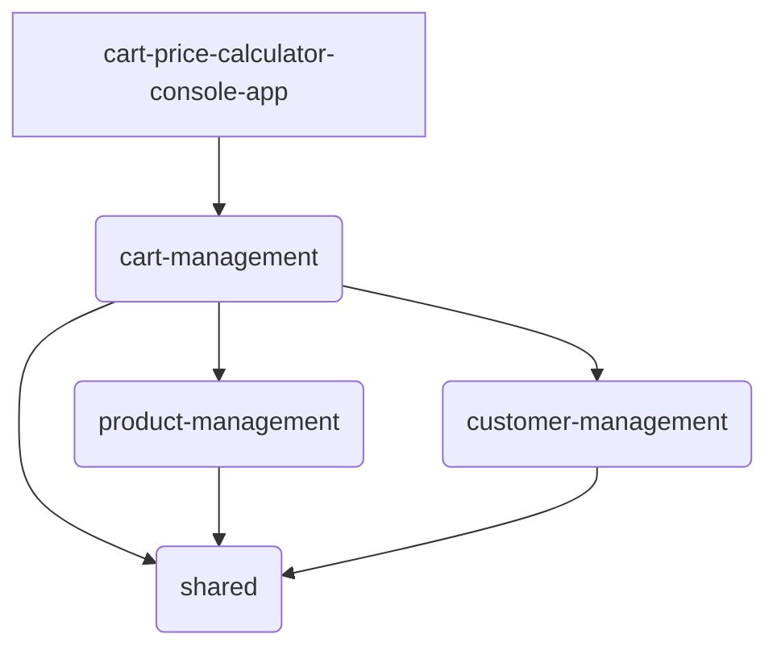
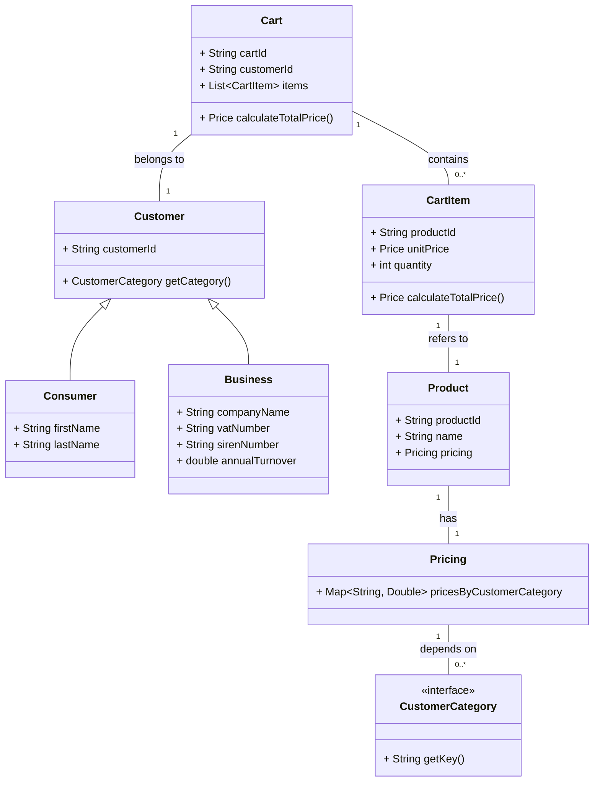

# Cart Price Calculator

This project implements a console application to calculate the total price of a shopping cart based on different product types and customer categories. It demonstrates a multi-module Maven project structure with a focus on Domain-Driven Design (DDD) principles.

## Architecture Overview

The project is structured as a multi-module Maven project, adhering to Domain-Driven Design (DDD) principles. This modular approach promotes separation of concerns, maintainability, and scalability.

The main modules are:



### Module Breakdown

*   **`shared`**:
    This module contains common utilities, value objects (e.g., `Money`, `Identifier`), and exceptions that are shared across other modules. It defines the `CustomerCategory` interface, which is crucial for categorizing customers.

*   **`product-management`**:
    Responsible for managing product data and defining the pricing logic. It handles the different price points for high-end phones, mid-range phones, and laptops, considering various customer categories.

*   **`customer-management`**:
    Manages customer data, distinguishing between `Consumer` (individual) and `Business` clients. It encapsulates the specific attributes and behaviors of each customer type, including annual turnover for business clients, which influences pricing.

*   **`cart-management`**:
    The core module for orchestrating shopping cart operations. It allows adding, updating, and removing items from a cart. Crucially, it calculates the total price of the cart by interacting with the `product-management` and `customer-management` modules to apply the correct pricing based on the customer's category and the products in the cart.

*   **`cart-price-calculator-console-app`**:
    The main executable application. It provides a command-line interface (CLI) using Spring Shell, allowing users to interact with the system to create carts, add products, update quantities, and view cart summaries. It integrates all other modules to provide the complete functionality.

## Domain Model

The core domain aggregates and their relationships are illustrated below:



## Key Features

*   **Flexible Customer Categorization**: Differentiates between individual consumers and business clients, with business clients further categorized by annual turnover.
*   **Dynamic Pricing**: Product prices are dynamically calculated based on the customer's category and business turnover, ensuring accurate pricing for each transaction.
*   **Comprehensive Cart Management**: Users can add multiple instances of products, update quantities, and remove items from their carts.
*   **Detailed Cart Summary**: Provides a clear breakdown of items in the cart, unit prices, quantities, and the final total price.
*   **Console-Based Interaction**: A user-friendly command-line interface for easy interaction and testing.

## Testing Strategy

The testing strategy primarily focuses on validating the core domain logic, ensuring its correctness and robustness. This is reflected in the concentration of tests within modules like `cart-management` and `customer-management`, which encapsulate complex calculations and critical business rules. Notably, the `cart-management` module includes integration tests to verify the seamless interaction between its components and other modules. Conversely, the application layers, which are more concerned with orchestration and data transfer, have minimal or omitted tests, aligning with the emphasis on thorough domain validation.

## Technologies Used

*   **Java 17**: The primary programming language.
*   **Maven**: Used for project build automation and dependency management.
*   **Spring Boot**: Provides the foundation for building robust, production-ready Spring applications.
*   **Spring Shell**: Enables the creation of the interactive command-line interface.
*   **Lombok**: Reduces boilerplate code for Java classes.
*   **JUnit 5**: The testing framework used for unit and integration tests.

## How to Build and Run

To build the project, navigate to the root directory (`cart-price-calculator`) and execute the following Maven command:

```bash
mvn clean install
```

After a successful build, you can run the console application from the root directory:

```bash
java -jar cart-price-calculator-console-app/target/cart-price-calculator-console-app-1.0.0.jar
```

This will start the Spring Shell application, and you will be presented with a prompt.

## Usage Examples

Once the application is running, you can use the following commands:

### Listing Data

*   **List all customers**:
    ```bash
    list customers
    ```
*   **List all products with their prices**:
    ```bash
    list products
    ```
*   **List all existing carts**:
    ```bash
    list carts
    ```

### Cart Operations

*   **Create a cart for a customer**:
    ```bash
    cart create --customerId <customer-id>
    ```
    *Example*: `cart create --customerId CUST001`

*   **Add an item to a cart**:
    ```bash
    cart add --cartId <cart-id> --productId <product-id> [--quantity <number>]
    ```
    *Example*: `cart add --cartId CART001 --productId PROD001 --quantity 2`

*   **Update quantity of a product in a cart**:
    ```bash
    cart updateQuantity --cartId <cart-id> --productId <product-id> --quantity <new-quantity>
    ```
    *Example*: `cart updateQuantity --cartId CART001 --productId PROD001 --quantity 5`

*   **Display a summary of a cart**:
    ```bash
    cart summary --cartId <cart-id>
    ```
    *Example*: `cart summary --cartId CART001`

## Disclosure
All of the project documentation and portions of the boilerplate and test code were generated with the assistance of AI tools.
